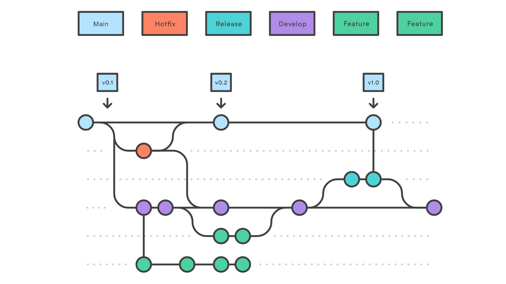

<div align="center"></div>
<h1 align="center">Gitflow Workflow</h1>
<p>Gitflow is a legacy Git workflow that was originally a disruptive and novel strategy for managing Git branches. Gitflow has fallen in popularity in favor of trunk-based workflows, which are now considered best practices for modern continuous software development and DevOps practices.</p>
<h2>🔸Develop and main branches</h2>

<p>Instead of a single main branch, this workflow uses two branches to record the history of the project. The main branch stores the official release history, and the develop branch serves as an integration branch for features. It's also convenient to tag all commits in the main branch with a version number.

The first step is to complement the default main with a develop branch. A simple way to do this is for one developer to create an empty develop branch locally and push it to the server:
```
git branch develop
git push -u origin develop
```
This branch will contain the complete history of the project, whereas main will contain an abridged version. Other developers should now clone the central repository and create a tracking branch for develop.</p>
<h2>🔸Feature branches</h2>

<p>Each new feature should reside in its own branch, which can be pushed to the central repository for backup/collaboration. But, instead of branching off of main, feature branches use develop as their parent branch.

When a feature is complete, it gets merged back into develop. Features should never interact directly with main.
Feature branches are generally created off to the latest develop branch.</p>
🔹Creating a feature branch

```
git checkout develop
git checkout -b feature_branch
```

🔹Finishing a feature branch
<p>When you’re done with the development work on the feature, the next step is to merge the feature_branch into develop.</p>

```
git checkout develop
git merge feature_branch
```
<h2>🔸Release branches</h2>

<p>Once develop has acquired enough features for a release (or a predetermined release date is approaching), you fork a release branch off of develop. Creating this branch starts the next release cycle, so no new features can be added after this point—only bug fixes, documentation generation, and other release-oriented tasks should go in this branch. Once it's ready to ship, the release branch gets merged into main and tagged with a version number. In addition, it should be merged back into develop, which may have progressed since the release was initiated.

Using a dedicated branch to prepare releases makes it possible for one team to polish the current release while another team continues working on features for the next release. It also creates well-defined phases of development.

Making release branches is another straightforward branching operation. Like feature branches, release branches are based on the develop branch.</p>

🔹Creating a release branch

```
git checkout develop
git checkout -b release/0.1.0
```
<p>Once the release is ready to ship, it will get merged it into main and develop, then the release branch will be deleted. It’s important to merge back into develop because critical updates may have been added to the release branch and they need to be accessible to new features. If your organization stresses code review, this would be an ideal place for a pull request.</p>
🔹Finishing a release branch

```
git checkout main
git merge release/0.1.0
```
<h2>🔸Hotfix branches</h2>

<p>Maintenance or “hotfix” branches are used to quickly patch production releases. Hotfix branches are a lot like release branches and feature branches except they're based on main instead of develop. This is the only branch that should fork directly off of main. As soon as the fix is complete, it should be merged into both main and develop (or the current release branch), and main should be tagged with an updated version number.</p>
<p>Having a dedicated line of development for bug fixes lets your team address issues without interrupting the rest of the workflow or waiting for the next release cycle. You can think of maintenance branches as ad hoc release branches that work directly with main.</p>
🔹Creating a hotfix branch

```
git checkout main
git checkout -b hotfix_branch
```
🔹Finishing a release branch

```
git checkout main
git merge hotfix_branch
git checkout develop
git merge hotfix_branch
git branch -D hotfix_branch
```
<h2>🔸Summary</h2>
Gitflow is one of many styles of Git workflows you and your team can utilize.

🔹The overall flow of Gitflow is:
- A develop branch is created from main.
- A release branch is created from develop.
- Feature branches are created from develop.
- When a feature is complete it is merged into the develop branch.
- When the release branch is done it is merged into develop and main.
- If an issue in main is detected a hotfix branch is created from main.
- Once the hotfix is complete it is merged to both develop and main.

<a style="font-weight:bold" href="https://www.atlassian.com/git/tutorials/comparing-workflows/gitflow-workflow">Source</a>
