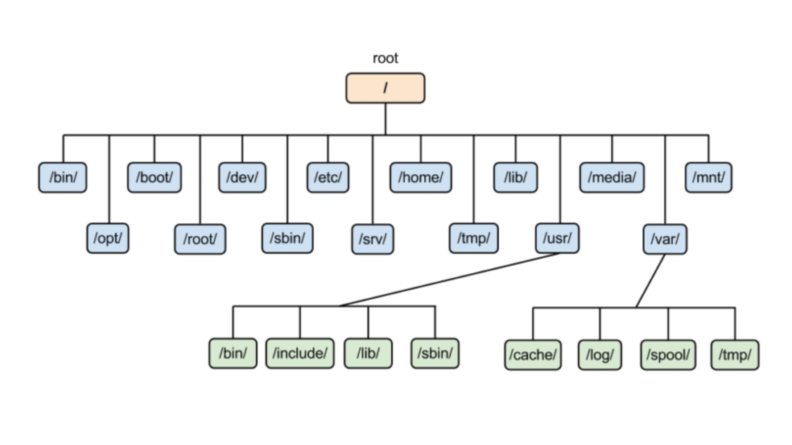

<h1 align="center">Linux Directory Structure</h1>

 
<h2>🔸/ – Root</h2>

Everything, all the files and directories, in Linux are located under ‘root’ represented by ‘/’. If you look at the directory structure, you’ll realize that it is similar to a plant’s root.

<h2>🔸/bin – Binaries</h2>

The ‘/bin’ directly contains the executable files of many basic shell commands like ls, cp, cd etc. Mostly the programs are in binary format here and accessible by all the users in the Linux system.

<h2>🔸/dev – Device files</h2>

This directory only contains special files, including those relating to the devices. These are virtual files, not physically on the disk.

Some interesting examples of these files are:
- /dev/null: can be sent to destroy any file or string
- /dev/zero: contains an infinite sequence of 0
- /dev/random: contains an infinite sequence of random values

<h2>🔸/etc – Configuration files</h2>

The /etc directory contains the core configuration files of the system, use primarily by the administrator and services, such as the password file and networking files.

If you need to make changes in system configuration (for example, changing the hostname), this is where you’ll find the respective files.

<h2>🔸/usr – User binaries and program data</h2>

in ‘/usr’ go all the executable files, libraries, source of most of the system programs. For this reason, most of the files contained therein is read­only (for the normal user)

- ‘/usr/bin’ contains basic user commands
- ‘/usr/sbin’ contains additional commands for the administrator
- ‘/usr/lib’ contains the system libraries
- ‘/usr/share’ contains documentation or common to all libraries, for example ‘/usr/share/man’ contains the text of the manpage

<h2>🔸/home – User personal data</h2>

Home directory contains personal directories for the users. The home directory contains the user data and user-specific configuration files. As a user, you’ll put your personal files, notes, programs etc in your home directory.

<h2>🔸/lib – Shared libraries</h2>

Libraries are basically codes that can be used by the executable binaries. The /lib directory holds the libraries needed by the binaries in /bin and /sbin directories.

Libraries needed by the binaries in the /usr/bin and /usr/sbin are located in the directory /usr/lib.

<h2>🔸/sbin – System binaries</h2>

This is similar to the /bin directory. The only difference is that is contains the binaries that can only be run by root or a sudo user. You can think of the ‘s’ in ‘sbin’ as super or sudo.

<h2>🔸/tmp – Temporary files</h2>

As the name suggests, this directory holds temporary files. Many applications use this directory to store temporary files. Even you can use directory to store temporary files.

But do note that the contains of the /tmp directories are deleted when your system restarts. Some Linux system also delete files old files automatically so don’ store anything important here.

<h2>🔸/var – Variable data files</h2>

Var, short for variable, is where programs store runtime information like system logging, user tracking, caches, and other files that system programs create and manage.

The files stored here are NOT cleaned automatically and hence it provides a good place for system administrators to look for information about their system behavi

<h2>🔸/boot – Boot files</h2>

The ‘/boot’ directory contains the files of the kernel and boot image, in addition to LILO and Grub. It is often advisable that the directory resides in a partition at the beginning of the disc.

<h2>🔸/proc – Process and kernel files</h2>

The ‘/proc’ directory contains the information about currently running processes and kernel parameters. The content of the proc directory is used by a number of tools to get runtime system information.

For example, if you want to check processor information in Linux, you can simply refer to the file /proc/cpuinfo. You want to check memory usage of your Linux system, just look at the content of /proc/meminfo file.

<h2>🔸/opt – Optional software</h2>

Traditionally, the /opt directory is used for installing/storing the files of third-party applications that are not available from the distribution’s repository.

The normal practice is to keep the software code in opt and then link the binary file in the /bin directory so that all the users can run it.

<h2>🔸/root – The home directory of the root</h2>

There is /root directory as well and it works as the home directory of the root user. So instead of /home/root, the home of root is located at /root. Do not confuse it with the root directory (/).

<h2>🔸/media – Mount point for removable media</h2>

When you connect a removable media such as USB disk, SD card or DVD, a directory is automatically created under the /media directory for them. You can access the content of the removable media from this directory.

<h2>🔸/mnt – Mount directory</h2>

This is similar to the /media directory but instead of automatically mounting the removable media, mnt is used by system administrators to manually mount a filesystem.

<h2>🔸/srv – Service data</h2>

The /srv directory contains data for services provided by the system. For example, if you run a HTTP server, it’s a good practice to store the website data in the /srv directory.

<h2>🔸/sys – System files</h2>

The /sys directory contains information about the various system components and drivers. It's akin to /proc but structured differently. Sysadmins use /proc and /sys inter-changeably to collect data.

<!-- .................................. -->
