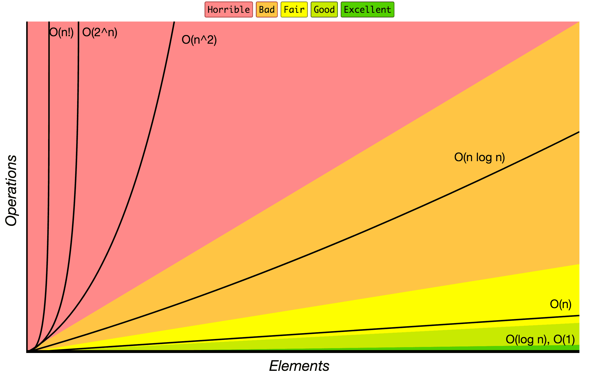

# Big O notation
How code slows as data grows.

- Its a way to describe the efficiency of an algorithm,
specifically how time or space requirements grow relative to the size of the input.
- Describe the performance of an algorithm as the amount of data increases

-----------------------

## types:

### O(1) - Constant Time
*No matter how big the input is, the time doesn't change*
```javascript
function addUp(n) {
    const sum = n * (n + 1) / 2;
    return sum;
}
```
---

### O(log n) - Logarithmic Time
*The time grows slowly as input size increases*
```javascript
function binarySearch(arr, target) {
  const left = 0, right = arr.length - 1;
  while (left <= right) {
    const mid = floor((left + right) / 2);
    if (arr[mid] === target) return mid;
    else if (arr[mid] < target) left = mid + 1;
    else right = mid - 1;
  }
  return -1;
}
```

---

### O(n) - Linear Time
*The time grows directly in proportion to input size*
```javascript
function addUp(n) {
    const sum = 0;
    for (int i = 0, i <= n; i++) {
        sum += i;
    }
    return sum;
}
```

---


### O(n log n) - Linearithmic Time
*More than linear, but much better tha quadratic*
```javascript
function mergeSort(arr) {
  if (arr.length <= 1) return arr;
  const mid = Math.floor(arr.length / 2);
  const left = mergeSort(arr.slice(0, mid));
  const right = mergeSort(arr.slice(mid));
  return merge(left, right);
}
```

---

### O(n²) - Quadratic Time
*Time grows with the square of the input size*
```javascript
function hasDuplicates(arr) {
  for (let i = 0; i < arr.length; i++) {
    for (let j = i + 1; j < arr.length; j++) {
      if (arr[i] === arr[j]) return true;
    }
  }
  return false;
}
```

---

### O(2ⁿ) — Exponential Time
*Time doubles with each additional input*
```javascript
function fibonacci(n) {
  if (n <= 1) return n;
  return fibonacci(n - 1) + fibonacci(n - 2);
}
```

---

### O(n!) — Factorial Time
*Every additional input multiplies the work drastically*
```javascript
function permute(arr) {
  if (arr.length <= 1) return [arr];
  const result = [];
  for (let i = 0; i < arr.length; i++) {
    const rest = permute(arr.slice(0, i).concat(arr.slice(i + 1)));
    for (let r of rest) {
      result.push([arr[i], ...r]);
    }
  }
  return result;
}
```

## visualization

